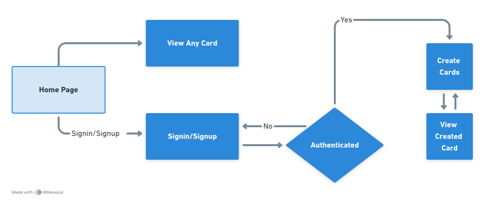

# Patra

## Introduction:

**Patra is the open-source digital card generator for students and professionals. Create and share your digital card with a unique ID for anyone to view.**


## Tech Stack

- [TypeScript](https://www.typescriptlang.org/) – language
- [Tailwind CSS](https://tailwindcss.com/) – styling
- [PostgreSQL](https://www.postgresql.org/) – database
- [Prisma ORM](https://www.prisma.io/) – database operations
- [bcrypt](https://www.npmjs.com/package/bcrypt) – password hashing
- [JWT](https://jwt.io/) – authentication
- [zod](https://zod.dev/) – validation
- [React](https://reactjs.org/) – frontend library
- [React-Hook-Forms](https://react-hook-form.com/) – form handling
- [Node.js](https://nodejs.org/) – backend runtime
- [Express](https://expressjs.com/) – backend framework
- [Turborepo](https://turborepo.org/) – monorepo management
- [Axios](https://axios-http.com/) – HTTP client
- [Cloudinary](https://cloudinary.com/) – image management

## Usage Overview




## Getting Started

**To get a local copy up and running, follow these steps.**

### Prerequisites 

- `Node.js`
- `npm`
- `PostgreSQL`


### Installation

1. **Clone the repository**
    ```bash
    git clone https://github.com/<YOUR_OWN_FORK>/Patra.git
    cd Patra
    ```

2. **Install Dependencies For Mono Repo**
    ```bash
    npm install
    ```

### Backend

1. **Create a `postgres` Database**
     - Some popular options include:
        - Using `docker` locally
        - Using `aiven`
        - Using `supabase`

2. **Set up environment variables**
   - A `.env.example` file is included in the root directory of the project as a template. 
   - Copy this `.env.example` file to a new file named `.env` and update it with your actual configuration values.
   ```bash
   cd apps/server
   cp .env.example .env
   ```   

3. **Run installation and Migration Scripts**
    ```bash
    npm install
    npm run generate
    npm run migrate
    ```

4. **Build the backend anytime you want to start a server**
    ```
    npm run build
    ```

4. **Start the server**
   ```bash
   npm run dev
   ```
   
   - This will start the server on the port specified in your `.env` file (or `3000` if not specified). 
   - You should see a message indicating that the server is running at <YOUR_DEFINED_PORT>

### Frontend

1. **Navigate to the frontend directory**
    ```bash
    cd apps/client
    ```

2. **Install frontend dependencies**
    ```bash
    npm install
    ```

4. **Start the frontend development server**
    ```bash
    npm run dev
    ```
   - This will start the frontend on the port `5173`
   - You should see a message indicating that the frontend is 
   running at `http://localhost:5173`.


## Contribution

We welcome contributions from the community! If you have ideas, suggestions, or want to help improve Patra, please feel free to contribute.


## Documentation

The documentation is still in progress and needs your contribution. Feel free to contribute and help us make Patra better. 


## License
This project is licensed under the MIT License - see the [LICENSE.md](./LICENSE) file for details.